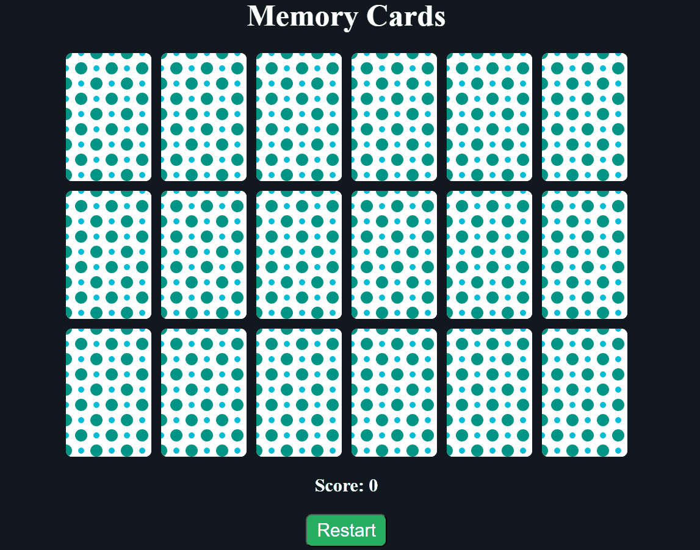

# Memory Card Game

This is a simple memory card game built using HTML, CSS, and JavaScript. The game consists of multiple cards, each hiding an image of a fruit. The objective is to match pairs of cards with the same fruit by flipping them over. The game includes a score system that tracks the number of tries it takes for a user to match all the pairs correctly.

## Features

- Interactive gameplay: Users can flip cards by clicking on them to reveal the hidden fruit images.
- Score tracking: The game keeps track of the number of attempts it takes for the user to match all pairs correctly.
- Randomized card positions: The positions of the cards are randomized each time the game starts, providing a new challenge with each playthrough.

## Technologies Used

- HTML
- CSS
- JavaScript

## How to Play

1. Make a local copy of code and run it on http.server using python.
2. Go to http://localhost:8000/ for  playing the game in your web browser.
3. Click on any card to reveal the fruit behind it.
4. Click on another card to reveal its fruit.
5. If the fruits match, both cards will remain face up. If not, they will flip back over.
6. Continue until all pairs are matched.
7. Your score will be displayed at the end, showing the number of tries it took to match all pairs.

## Demo

Enjoy the challenge of Memory Card Game! 🎮🍏🍊